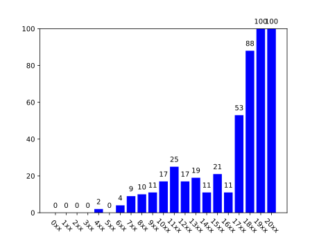

# Beta Kappa Family Trees

## Progress



## Updating

1.  Add new members/information to Membership archive
2.  Run `scripts/convert.py`
3.  Update git repo

## Python Script

```
usage: convert.py [-h] [-v] [-o OUTPUT]

optional arguments:
  -h, --help            show this help message and exit
  -v, --verbose         print stats to the console
  -o OUTPUT, --output OUTPUT
                        JSON file to dump into
```

## JSON Format

```
{
  ...
  "1940" : {
    "id" : "1940",
    "name" : "Gordon Nail",
    "big" : "1846",
    "children" : ["1956", "1986"],
    "active" : false
  },
  ...
}
```
