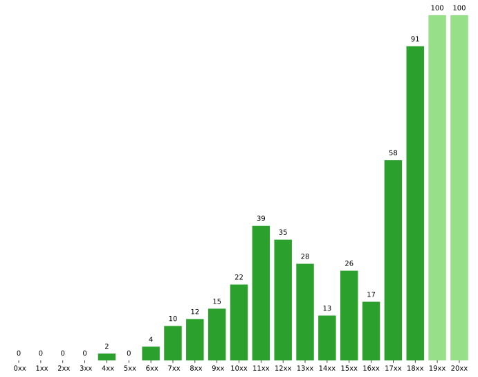

# Beta Kappa Family Trees

## Progress



## Updating

1.  Add new members/information to Membership archive
2.  Export as a `.csv`
3.  Run `python3 scripts/convert.py data/archive.csv [data/archive.json]`
4.  Update git repo

## JSON Format

```
{
  ...
  "1940" : {
    "id" : "1940",
    "name" : "Gordon Nail",
    "big" : "1846",
    "children" : ["1956", "1986"],
    "active" : false
  },
  ...
}
```
